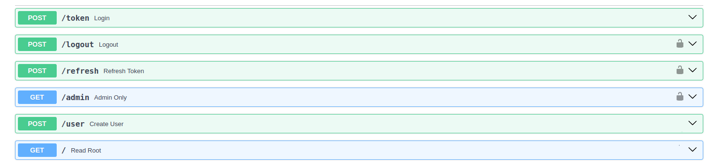
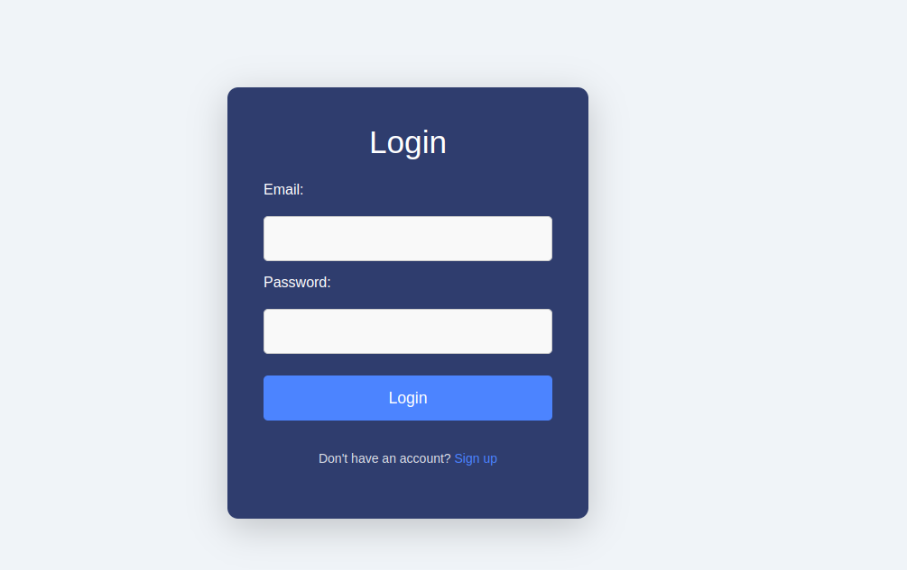
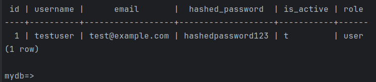
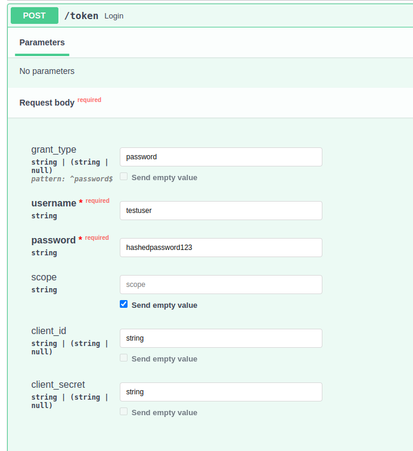
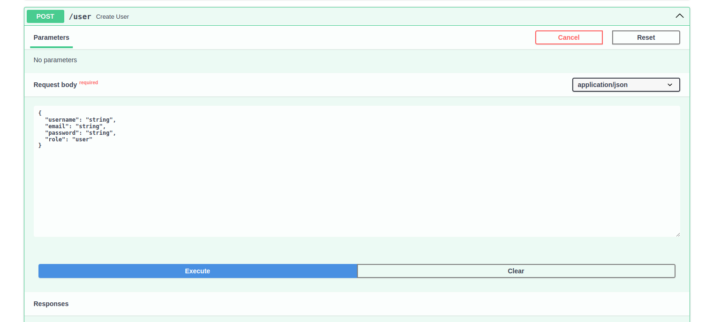
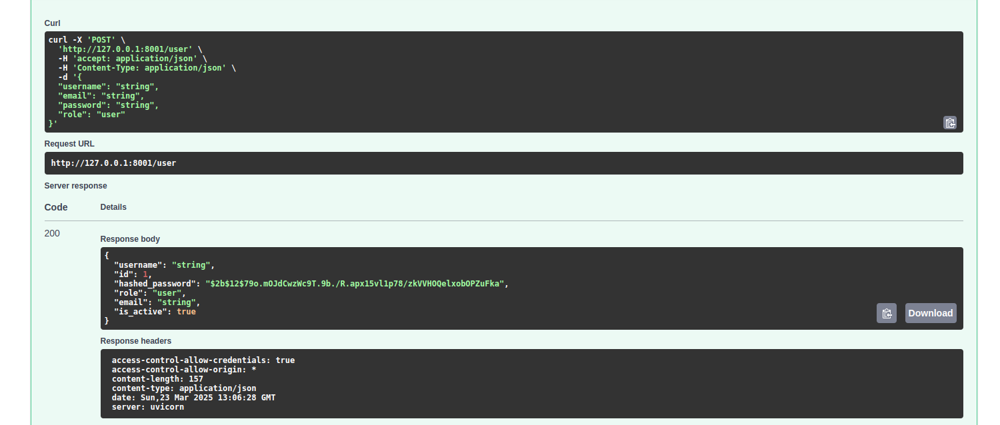
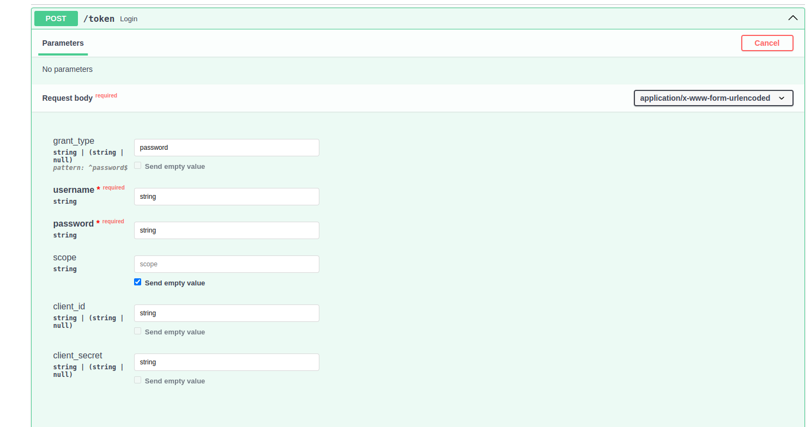

#### **Что реализованно**:
- Система авторизации и аутентификации с использованием ` Redis и JWT` 

#### Основные компоненты:
- ` JWT (JSON Web Token)` : Используется для создания токенов
- ` Redis` : Используется для хранения черного и белого списков токенов. Белый список — это активные токены, черный список — отозванные или недействительные токены.

#### Реализация:
- Генерация токена: При успешной авторизации создается JWT, который сохраняется в Redis (белый список) и возвращается клиенту.
- Проверка токена: При каждом запросе проверяется, есть ли токен в белом списке и отсутствует ли он в черном списке.
- Отзыв токена: При выходе пользователя из системы токен добавляется в черный список в Redis.

####  Выбор способа взаимодействия с контентом:

#### REST API:
- REST API, так как это стандартный и широко используемый подход для взаимодействия между клиентом и сервером.
- REST API прост в реализации, легко масштабируется и поддерживается. Он также хорошо подходит для работы с JWT, так как токены могут передаваться в заголовках запросов.

#### Утечки токенов и защита

- Перехват токена: Если токен передается по незащищенному каналу (HTTP вместо HTTPS).
- Кража токена: Если токен хранится на клиенте в небезопасном месте (например, в localStorage без защиты).

### API
<figure>
  
  <figcaption>Методы</figcaption>
</figure>

Форма login-page: (Просто пример фронта - без url в js)

<figure>
  
  <figcaption>Форма login-page</figcaption>
</figure>

#### Задание:
Как избежать утечек токена?

1. Использование HTTPOnly и Secure флагов для куки 
    - Если токен хранится в куках, установите флаги HTTPOnly и Secure
    - HTTPOnly предотвращает доступ к куке через JavaScript. 
    - Secure гарантирует, что кука передается только по HTTPS.

2. Использование CORS (Cross-Origin Resource Sharing) 
   - Ограничивает доступ к  API только с доверенных доменов.

3. Ограничение времени жизни токена
   - Устанавливайте короткое время жизни для токенов и используйте механизм обновления токенов (refresh tokens)

4. Использование JWT (JSON Web Tokens)
   - JWT позволяет подписывать токены, что делает их более безопасными. 

5. Защиту от атак Brute Force и XSS, Clickjacking.

6. Заголовки безопасности.

#### Запуск:
- docker-compose -f docker/docker-compose.yml build
- docker-compose -f docker/docker-compose.yml up -d --force-recreate
- docker logs docker-api-1 - само приложение
- Проверка - docker ps -a

**Материалы для написания**
- https://habr.com/ru/articles/829742/

Таблица вида:
` 
CREATE TABLE users (
    id SERIAL PRIMARY KEY,
    username VARCHAR UNIQUE NOT NULL,
    email VARCHAR UNIQUE NOT NULL,
    hashed_password VARCHAR NOT NULL,
    is_active BOOLEAN DEFAULT TRUE,
    role VARCHAR DEFAULT 'user'
);
` 
или миграция -  ` alembic upgrade head` 

Пример работы:
1. Создание пользователя.

<figure>
  
  <figcaption>DataBase</figcaption>
</figure>

2. Входим под его логин и паролем.

<figure>
  
</figure>

3. Результат

<figure>
  
</figure>

Еще один полный тест:

1. Создаем юзере через API:
<figure>
  
</figure>

2. Проверим, что создался:

<figure>
  
</figure>

3. Проверим метод с токеном:  Введем логин + пароль - должен найти в БД 
Если есть - то, отдает токен, если нет ошибку.

<figure>
  
</figure>

Получили:

<figure>
  
</figure>

